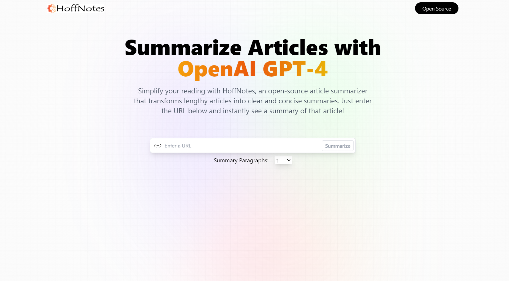

  

## Index

1. [Description](#description)
3. [Usage](#usage)
4. [Technology](#technology)
4. [Preview](#preview)
4. [Installation](#installation)
6. [Contributing](#contributing)
7. [Resources](#resources)
8. [License](#license)

## Description

Easy to use React Application using OpenAI GPT-4 to summarize long atricles into brief synopsis.

## Usage

This app is deployed using Netifly at <https://hoffnotes.netlify.app/>. On page load user is provided with two inputs. the first to enter a URL containg the article they would like summarized and a dropdown to choose the length of the summary between 1-4 paragraphs. After entering the inputs the user presses the 'summaraize' button and the summary will be shown below. In addition to that the url will be shown below and the summary is saved to users local storage. All recent searches will be shown below the input boxes and user can click back between them. There is also a copy feature that will allow the user to copy the url to thier clipboard. 

## Technology

1. `React:`
2. `Git/Github:` Repo and version management.
3. `TailwindCss`: For most of the CSS styling.
4. `RapidAPI`: Use the article extractor and summarizer API.
5. `Netifly`: Deployment.
6. NPM Packages: `GoogleFonts`, `Axios`
7. `Vite`: React build.

## Preview

  
 

## Installation

Setup: 
- (1) Fork the repo, (2) Clone the forked repo locally, (3) Run "npm install" (to install the dependencies), (5) Launch Server = "npm run dev".

- Will need to setup a .env file with one variable VITE_RAPID_API_ARTICLE_KEY. This key can be attained on RapidAPI 'Article Extractor and Summarizer' found here  <https://rapidapi.com/restyler/api/article-extractor-and-summarizer>

## Contributing

Contributor Covenant Code of Conduct

## Resources

1. GitHub Repo: <https://github.com/Hoffalypse/Article-Summary>
2. Heroku Deploy: <https://hoffnotes.netlify.app/> 

## License

This project is licensed under the terms of the The MIT License. Please click on the license badge for more information.

